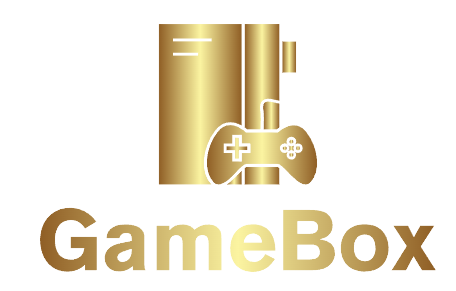
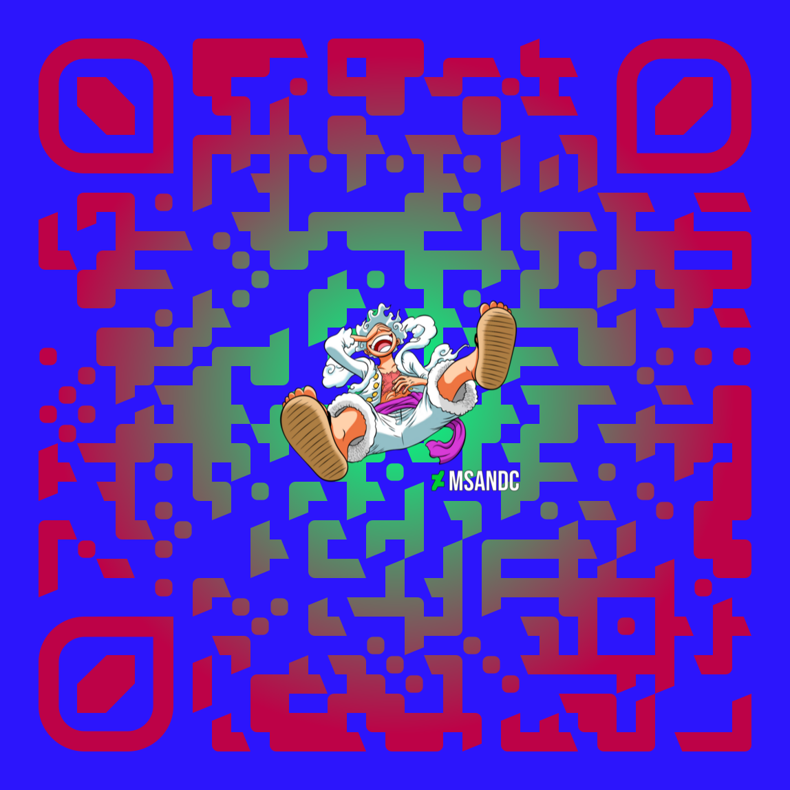

# GamewBox

## Description

 Our goal for this application was to make a user experience that allows navigation through the rawg.io API in a manner that is suited for an easy and intuitive layout in order to provide the information on the video games they wish to gain more knowledge on. We learned how to work together as a group to achieve a MVP within a weeks worth of work. Specific skills acquired include the ability to fully implement a chart.js graph with API data inserted in the graph, also picking up lots of knowledge on fetching API's and creating dynamic elements to the website, other abilities obtained: Bulma, FontAwesome, googleFonts. these different frameworks, libraries and resources allowed us to accomplish our goal of having a minimum viable product.

## Table of Contents
*[Title](#title)

*[Description](#description)
    
*[Installation](#installation)
    
*[Usage](#usage)
    
*[License](#license)
    
*[Contributors](#contributor)
    
*[Tests](#test)
    
*[Questions](#questions)

*[URL](#URL)
    

## Installation

open html in browser

## Usage
- We used chart.js hover abilities on the charts in order to get specific data that they relay. 
- We have a save option for specific games the user might wanna view in the future.
- The user may also encounter modals that prevent them from going further on their search if the specified game is not typed in correctly.
- buttons on the Wishlist section of the page that allow the user to track back to games that intrigue them.

## Contributors

- Ryan.business.bowen@gmail.com
- shawnbunch@gmail.com
- fordefam12@gmail.com
- gioggonzalez214@gmail.com

## License

## badges

             
             

## Questions
Any questions about this project please send me a message on *https://github.com/fordefam12 or email me at [fordefam12@gmail.com]

## URL
  https://github.com/fordefam12/gameBox!

<a href='https://fordefam12.github.io/gameBox/'>
CLICK QR CODE for deploy link
// </a>

## Screenshots

.png>)